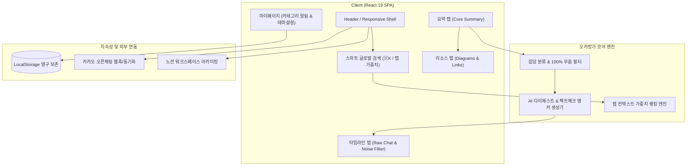
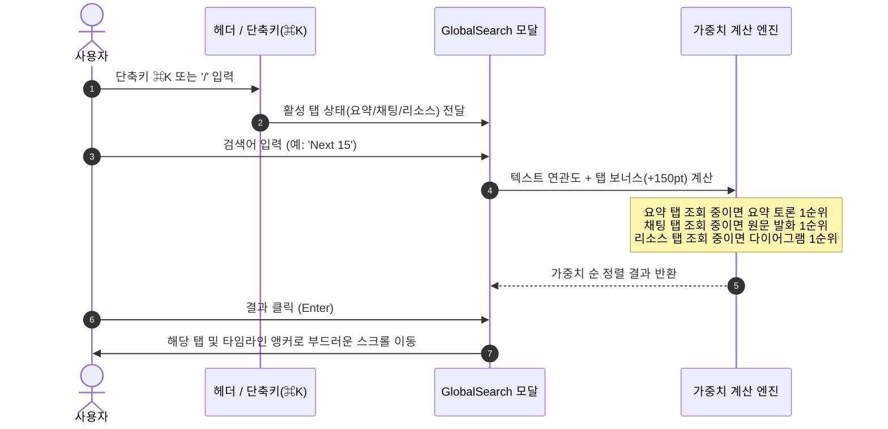

# 💬 오카방가방가 (Okabang)
> **오픈카톡 잡담 94% 자동 필터링 & 핵심 토론 학습 요약 서비스**  
> *하루 1,200건의 쏟아지는 잡담 속에서 실무진의 진짜 기술 인사이트와 장애 대응 노하우만 3분 만에 쏙쏙!*

---

## 🌐 서비스 배포 링크 (Live URLs)

| 구분 | 접속 URL | 상태 |
| :--- | :--- | :---: |
| **🚀 상용 배포 URL (Production)** | `https://okabang.vercel.app` *(도메인 연결 예정)* | 🟢 대기 중 |
| **🔗 프리뷰/공유 URL (Shared Preview)** | [https://ais-pre-ehqgt6tikwdwo43ottjsrv-966056115157.asia-east1.run.app](https://ais-pre-ehqgt6tikwdwo43ottjsrv-966056115157.asia-east1.run.app) | 🟢 배포 완료 |
| **🛠️ 개발 환경 URL (Development)** | [https://ais-dev-ehqgt6tikwdwo43ottjsrv-966056115157.asia-east1.run.app](https://ais-dev-ehqgt6tikwdwo43ottjsrv-966056115157.asia-east1.run.app) | 🟢 가동 중 |

---

## 💡 프로젝트 기획 배경 및 의의 (Motivation & Value)

IT 개발자, 기획자, 디자이너들이 참여하는 대규모 오픈카톡방(FE 실무방, 인프라방, 테크 이직방 등)에는 **현업에서만 들을 수 있는 생생한 기술 트러블슈팅과 아키텍처 선정 노하우**가 공유됩니다.

그러나 하루에도 수천 건씩 쌓이는 일상 잡담(점심 메뉴, 출퇴근 인사, 이모티콘)으로 인해 정작 중요한 기술 토론이 빠르게 묻혀버리고, 다시 찾아보려 해도 검색이 매우 어렵습니다.

**'오카방가방가'는 이 문제를 해결하기 위해 탄생했습니다:**
1. **시간 절약 (94.2% 노이즈 감축)**: 대화 1,240건 중 잡담 1,180건을 무음 격리하고, 60건의 알짜 토론만 3분 요약본으로 재구성합니다.
2. **환각 없는 팩트체크 (Fact-Checking)**: AI 생성 요약의 허위 정보를 방지하기 위해, 요약문의 모든 근거를 실제 참여자의 대화 발화(`disc-1`, `disc-2`...)에 1:1 하이퍼링크로 연결합니다.
3. **업무 지식베이스 연결**: 요약된 토론과 추천 자료를 원클릭으로 노션(Notion) 워크스페이스에 동기화하거나 나에게 카카오톡으로 발송할 수 있습니다.

---

## 🏗️ 시스템 아키텍처 및 데이터 흐름 (Architecture)

### 1. 서비스 전체 아키텍처



### 2. 검색 및 탭 우선순위 동적 가중치 흐름 (Search Ranking Flow)



---

## 📁 디렉터리 구조 (Directory Structure)

```plaintext
okabang/
├── public/                 # 정적 리소스 파일
├── src/
│   ├── components/         # 핵심 UI 모듈 컴포넌트
│   │   ├── BottomNav.tsx                # 모바일 하단 네비게이션 바
│   │   ├── BottomQuickBar.tsx           # 모바일 하단 노션/카톡/북마크 원클릭 퀵바
│   │   ├── ChatTimelineTab.tsx          # 팩트체크 타임라인 및 잡담 아코디언
│   │   ├── CoreDiscussionsTagSection.tsx # AI 토론 라벨 및 사용자 커스텀 태그 섹션
│   │   ├── CustomTagManagerModal.tsx    # 커스텀 태그 추가/삭제 관리 모달
│   │   ├── DesktopFooter.tsx            # 데스크톱 푸터 영역
│   │   ├── DiscussionAtmosphereChart.tsx # 시간대별 대화 활성도 및 반응 레이더 차트
│   │   ├── GlobalSearch.tsx             # 탭 인식 동적 가중치 글로벌 스마트 검색기
│   │   ├── Header.tsx                   # 반응형 글로벌 상단 헤더
│   │   ├── HomeDigestTab.tsx            # 서비스 소개 및 퇴근길 다이제스트 뷰
│   │   ├── ImageModal.tsx               # 아키텍처 다이어그램 고해상도 줌 뷰어
│   │   ├── KakaoSyncModal.tsx           # 카카오 오픈채팅 연동 & 필터 설정 모달
│   │   ├── MyChatRoomsTab.tsx           # 내 참여 오픈채팅방 목록 및 정제 현황
│   │   ├── MyPageTab.tsx                # 요약 알림 토글, 테마 자동 모드, 사용자 프로필
│   │   ├── OnboardingGuideTooltip.tsx   # 신규 유저 온보딩 툴팁 배너
│   │   ├── ResourcesTab.tsx             # 아키텍처 구조도, 벤치마크, 외부 링크 모음
│   │   ├── RoomHeader.tsx               # 채팅방 서브탭 헤더 (요약 / 채팅 / 리소스)
│   │   ├── SavedInsightsTab.tsx         # 북마크 아카이빙 저장소
│   │   ├── ShareCardModal.tsx           # 요약 본문 카카오톡/SNS 공유 카드 생성기
│   │   ├── SummaryTab.tsx               # 94% 정제 핵심 요약 및 아젠다 카드
│   │   └── Toast.tsx                    # 글로벌 사용자 피드백 토스트 알림
│   ├── data/
│   │   └── mockData.ts      # 오픈채팅방, 요약본, 원문 발화, 리소스 데이터셋
│   ├── types.ts             # 전역 TypeScript 인터페이스 및 타입 정의
│   ├── App.tsx              # 메인 애플리케이션 진입점 및 전역 상태 관리
│   ├── main.tsx             # React 19 Root 마운트
│   └── index.css            # Tailwind CSS v4 스타일시트
├── tests/
│   └── e2e-flows.spec.ts    # 4대 핵심 사용자 흐름 E2E 테스트 스위트 (Playwright)
├── .env.example             # 환경 변수 설정 템플릿
├── metadata.json            # AI Studio 및 서비스 메타데이터
├── package.json             # 프로젝트 의존성 및 실행 스크립트
├── tsconfig.json            # TypeScript 컴파일러 구성 (tests 격리 포함)
└── vite.config.ts           # Rollup 청크 분할 및 Vite 빌드 최적화 설정
```

---

## ✨ 핵심 기능 (Key Features)

### 1. 🎯 탭 기반 스마트 글로벌 검색 (Contextual Global Search)
* **전역 단축키**: 언제 어디서든 `⌘K` 또는 `/` 키를 눌러 즉시 검색창 오픈
* **탭 컨텍스트 가중치 (+150pt)**:
  * **요약 탭** 조회 중: 핵심 요약 토론 및 결론 아젠다 최우선 정렬
  * **타임라인 탭** 조회 중: 현업자의 실제 발언과 질문/답변 버블 원문 최우선 정렬
  * **리소스 탭** 조회 중: 아키텍처 구조도 및 오픈소스 깃허브 링크 최우선 정렬
* **카테고리 필터 탭**: `전체 (스마트 순위)`, `💡 요약 토론`, `💬 채팅 발화`, `📁 리소스`, `🏠 오픈채팅방`
* **키보드 탐색**: `↑/↓` 화살표 이동, `Enter` 즉시 이동, `ESC` 닫기

### 2. 🛡️ 잡담 감축 & 핵심 요약 (Summary & Fact-Check)
* 잡담 182건 묶음 자동 아코디언 접기/펼치기
* 문제 제기 ➔ 실무 솔루션 ➔ 합의점 3단계 아젠다 구조화
* 요약문 근거 클릭 시 실제 발화 원문(`disc-1`, `disc-2`...)으로 80ms 지연 부드러운 스크롤 이동

### 3. 🌙 시스템 OS 테마 감지 자동 모드 (Display Theme)
* **라이트 / 다크 / 시스템 자동 모드** 3단 선택 지원
* `window.matchMedia`를 통해 기기 OS 테마 변경 실시간 감지
* 시스템 모드 동작 중 OS 테마 전환 시 Toast 안내 발송 및 `localStorage` 영구 보존

### 4. 🔔 맞춤 요약 푸시 알림 설정 (Notification System)
* 토론 주제별(기술/개발, 실무/트러블슈팅, 시사/업계동향, 잡담 100% 무음 차단, 커스텀 태그 우선) 선택적 알림 수신
* 즉시 실시간 푸시 ↔ 퇴근길 다이제스트(18:30) 발송 방식 선택
* 모의 푸시 시뮬레이션 버튼(기술 요약 수신, 잡담 무음 차단 등) 완비

### 5. 📱 모바일 앱 폰 쉘 시뮬레이터 ↔ 데스크톱 와이드 뷰 전환
* 상단 헤더 원클릭 버튼으로 아이폰 다이내믹 아일랜드 프레임 뷰와 반응형 데스크톱 뷰를 자유롭게 오가며 테스트 가능

---

## 🚀 시작하기 (Getting Started)

### 사전 요구사항
* Node.js 20.0.0 이상
* npm 또는 bun

### 설치 및 로컬 실행
```bash
# 1. 저장소 복제
git clone https://github.com/gripgrap/okabanga.git
cd okabanga

# 2. 의존성 패키지 설치
npm install

# 3. 환경 변수 파일 생성
cp .env.example .env

# 4. 로컬 개발 서버 실행 (포트 3000)
npm run dev
```

### 정적 분석 및 프로덕션 빌드
```bash
# TypeScript 정적 타입 검사
npm run lint

# 프로덕션 번들 빌드 (Rollup 청크 최적화 적용)
npm run build

# 빌드 결과물 미리보기
npm run preview
```

### E2E 테스트 실행
```bash
# Playwright 4대 핵심 흐름 자동화 테스트
npx playwright test tests/e2e-flows.spec.ts
```

---

## 🛠️ 기술 스택 (Tech Stack)

| 영역 | 기술 스택 | 선정 이유 |
| :--- | :--- | :--- |
| **Frontend** | React 19, TypeScript | 최신 리액트 아키텍처 및 엄격한 타입 안정성 확보 |
| **Styling** | Tailwind CSS v4 | 유틸리티 퍼스트 기반 초경량 빌드 및 다크 테마 일관성 |
| **Build Tool** | Vite 8, Rollup | HMR 빠른 개발 경험 및 Vendor 청크 분할 번들링 |
| **Icons & Fonts** | Material Symbols, Google Fonts | 직관적인 UI 심볼 및 Noto Sans KR / Plus Jakarta Sans |
| **Data Viz** | Recharts | 대화 시간대별 활성도 및 반응 레이더 차트 시각화 |
| **Testing** | Playwright Test | 크로스 브라우저 사용자 시나리오 E2E 검증 |
| **VCS** | Git, GitHub Actions | 브랜치 형상 관리 및 CI/CD 자동화 |

---

## 🔮 향후 개발 과제 (Roadmap / Future Work)

- [ ] **실시간 카카오톡 오픈채팅 웹훅 수신 파이프라인**: 챗봇 또는 내보내기 텍스트 수신 백엔드 연동
- [ ] **주간/월간 테크 리포트 PDF 내보내기**: 한 달간의 주요 개발 토론을 책자 형태 PDF 또는 Markdown 파일로 일괄 다운로드
- [ ] **AI 프롬프트 맞춤 템플릿**: 아키텍처 심층 분석형, 신입 개발자 온보딩용 쉬운 요약형 등 모드 선택
- [ ] **PWA(Progressive Web App) 및 Web Push API**: 모바일 홈 화면 설치 및 퇴근길(18:30) 푸시 알림 수신
- [ ] **크롬 브라우저 익스텐션 연동**: 웹 브라우저에서 카카오톡 웹버전이나 기술 아티클 조회 시 즉시 사이드바로 요약본 조회
